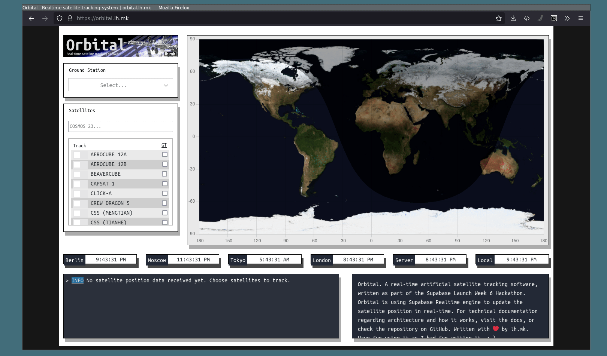
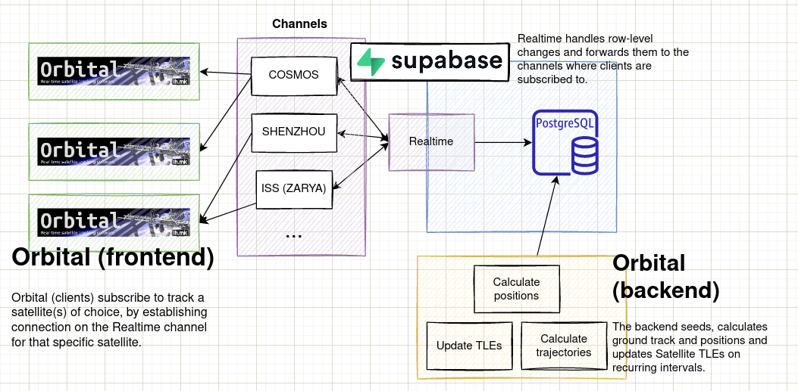
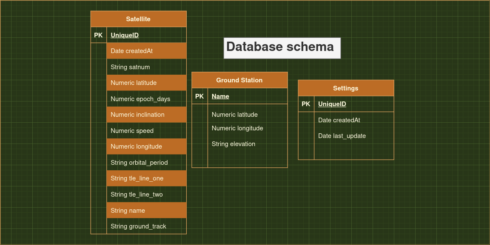
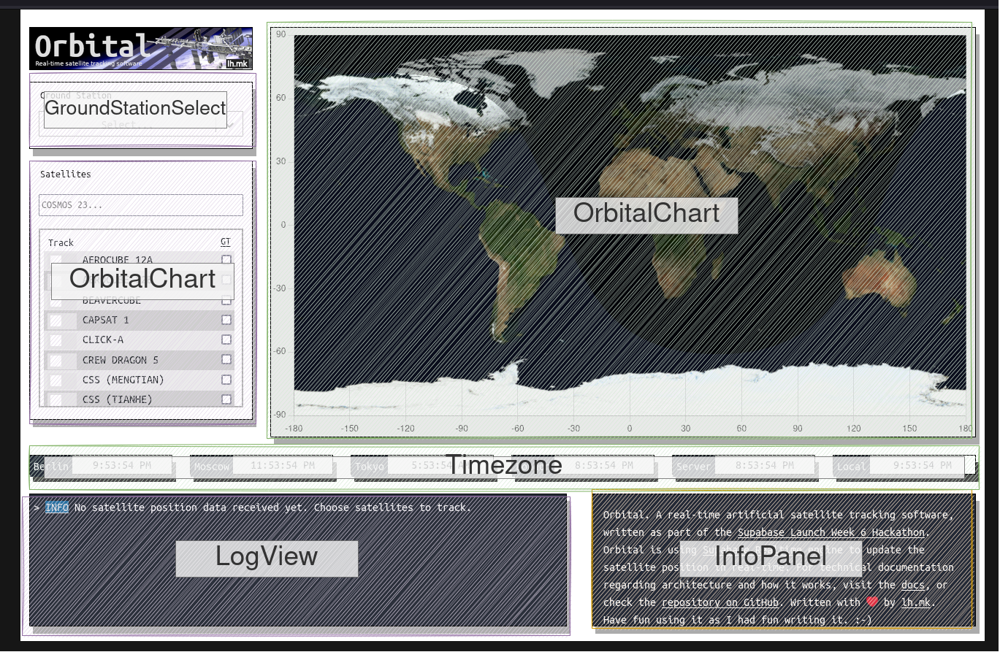

# Orbital - Realtime satellite tracking system

[](LICENSE.md)

This repository hosts Orbital. A realtime satellite tracking system for the web, with [Supabase Realtime](https://supabase.com/docs/guides/realtime) as its core dependency. Orbital is up and running on [orbital.lh.mk](https://orbital.lh.mk).

This software was written as part of the [Supabase Launch Week 6 Hackathon](https://supabase.com/blog/launch-week-6-hackathon). (team members: [@lubeskih](https://github.com/lubeskih)).

The whole system is written in TypeScript. Orbital is using Node.js on the backend, with an Express server and [Supabase](Supabase) for database interaction. On the frontend Orbital has React, Mobx for store and Supabase (client) to subscribe to satellite position changes.


_view in bigger resolution [here](https://github.com/lubeskih/orbital-sb/raw/master/assets/demo.gif)_

**Table of Contents**

- [How to build and run](#How-to-build-and-run)
- [How it works](#How-it-works)
  - [High-Level Architecture](#High-Level-Architecture)
  - [Database schema diagram](#Database-schema-diagram)
  - [Backend](#Backend)
  - [Frontend](#Frontend)
- [License](#License)

## How to build and run

To replicate the whole system, one must first:

1. Register a Supabase account
2. Create a project and a database
3. Replicate this database schema
4. Generate an **ANON_JWT** token
5. Write down your PG credentials
6. ... after that you have to manually setup the project:

```
$ git clone https://github.com/lubeskih/orbital.git
$ cd orbital

# Please edit src/frontend/src/store/env.ts
# and replace ANON_JWT_KEY and SUPABASE_API_URL
# with the credentials from your Supabase project.

$ cd frontend # yarn start (or yarn build to build)
$ cd ../server/
$ yarn install

$ nano .env # add PG_HOST, PG_PORT, PG_USER and PG_PASSWORD

# Since Orbital is in early stage of development
# one would have to manually edit code snippets to
# (1) seed the database
# (2) calculate ground tracks for the satellites
# (3) start calculating satellite positions

# To do so, first uncomment satelliteService.seedSatelliteDb() the init() function in server/src/app.ts, and comment out the rest. Exit and:
$ yarn start

# This will seed your database with the about ~40 space stations that are orbiting the Earth. If you want to change or seed with other data, please adjust server/src/service/satellite.service.ts; and edit the functions that fetch TLEs (search for "host" and "path" variables)

# Comment out the seed function and uncomment satelliteService.recalculateAndUpdateSatelliteGroundTrack to generate the ground tracks for the seeded satellites
# After this finishes, comment it out, and uncomment the interval blocks. These assure that:
# (1) Satellite position will be calculated every 5 seconds
# (2) Satellite ground track will be updated every 2 hours
# (3) Satellite TLE sets will be updated every 5 days
```

After this is done, you can visit `localhost:3000` to view the frontend and start tracking satellites.

### How it works

Orbital's frontend and backend don't interact directly with each other. Rather, uses Supabase Realtime to subscribe to database table changes. The backend runs crons that calculate satellite data and connects to the PostgreSQL database via a pg client to update it.

When you decide to "track" a satellite on the frontend, you essentially "subscribe" to row level changes for that satellite's data in the database. Supabase Realtime will assure to notify for all changes your are subscribed to.

### High-Level Architecture


_view in bigger resolution [here](https://github.com/lubeskih/orbital-sb/raw/master/assets/high-level-orbital.png)_

Involved actors

- Supabase as RT database provider
- Orbital frontend (browser) - subscribes to Realtime channels
- Orbital backend (server) - fetches, calculates, updates satellite positions via direct PG connection

PostgreSQL tables (check below for DB schema)

- Satellite
- Ground Station
- Settings

Backend:

- Server fetches the Satellite table and calculates the positions (latitude / longitude) every 5 seconds
- Server fetches the Satellite table and calculates the trajectories (3 hours ahead) of each satellite every 2 hours
- Server fetches the fresh TLE data from Celestrak every 5 days

Frontend:

- The client (browser) fetches all Satellites (**names**) from the Satellite table and provides them as an option for the user to track them
- The user can choose unlimited amount of satellites to track. By clicking on the satellite of choice, the frontend "subscribes" to the Realtime channel for that specific satellite and waits for position data
- The client fetches all available Ground Stations from the ground_station table. When a ground station is selected, it is pinned on the Earth map. Ground stations represent the location of the user.
- Clients can choose to stop tracking a satellite by unchecking the satellite in the listbox, which will unsubsribe from the channel of that satellite

### Database schema diagram


_view in bigger resolution [here](https://github.com/lubeskih/orbital-sb/raw/master/assets/database-diagram.png)_

The database consists of three tables:

- Satellite - keeps all relevant satellite data. This is the table that clients are subscribed to.
- Ground Station - keep city location data around the world
- Settings - used to keep track when were the TLEs last updated

### Backend

The backend follows an "onion architecture" pattern. There are two involved components:

```markdown
| #   | Component           | Usage                                           |
| --- | ------------------- | ----------------------------------------------- |
|     | satellite.service   | Calculates satellite positions and trajectories |
|     | supabase.repository | Interacts with Supabase PostgreSQL instance     |
```

### Frontend

The frontend includes 5 main components


_view in bigger resolution [here](https://github.com/lubeskih/orbital-sb/raw/master/assets/components.png)_

- `GroundStationSelect` - for selecting the ground station
- `OrbitalChart` - for displaying the satellite positions and trajectories (additionally calculates day/night overlay on Earth on load)
- `Timezone` - displays Server, Local and the time in few major cities
- `LogView` - Logs events (when receiving a satellite data or interacting with the frontend)
- `InfoPanel` - info

## License

This software is licensed under [MIT](LICENSE.md).
